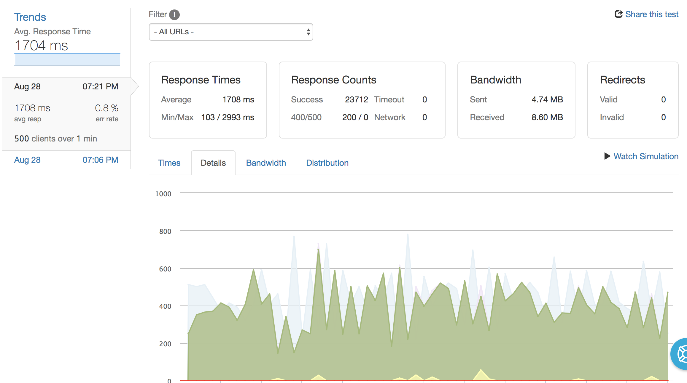

# Airbnb System Scaling Optimization-Sidebar
System Scaling and Optimization for Airbnb Experiences Item Page

# Compile React Code
> npm run build

# To Create CSV file for seeding:
> npm run csv

# To Seed Data from CSV to Database: (in PostgreSQL shell)
> \COPY sidebarimgs(experience, original, embedurl) FROM PATH_TO_Data.csv WITH CSV HEADER;

# To Start the Server:
> npm start
